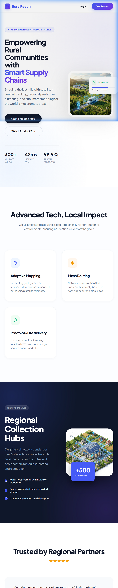
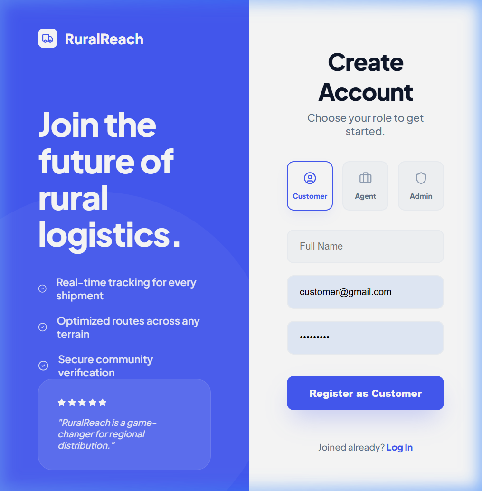
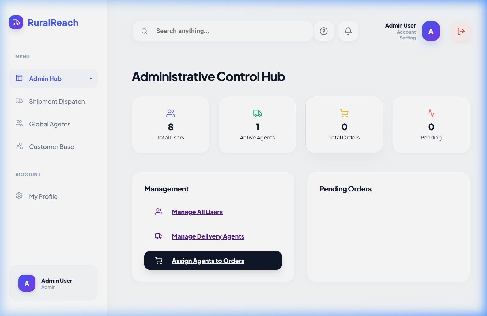

# 🚚 RuralReach — Smart Rural Logistics & Delivery Platform

<div align="center">

[](https://ruralreach-frontend.onrender.com)
[](https://www.figma.com/design/jxdjf4Gy8GGIGlDkfCaAZi/Custom-Login-page-and-Signup-page-UI--Community-?node-id=0-1&p=f&t=G3hDP2kgFm25oBn1-0)
[](https://documenter.getpostman.com/view/50840889/2sBXqKnfF5)
[](https://www.youtube.com/watch?v=wblTGqGLQ8c)
[](https://github.com/codinggita/ruralRich/pull/15)

</div>

---

## 🔗 Important Links

| Resource | Link |
|---|---|
| 🌐 **Live Frontend** | [ruralreach-frontend.onrender.com](https://ruralreach-frontend.onrender.com) |
| 🎨 **Figma Prototype** | [View UI/UX Design](https://www.figma.com/design/jxdjf4Gy8GGIGlDkfCaAZi/Custom-Login-page-and-Signup-page-UI--Community-?node-id=0-1&p=f&t=G3hDP2kgFm25oBn1-0) |
| 📬 **Postman Docs** | [API Documentation](https://documenter.getpostman.com/view/50840889/2sBXqKnfF5) |
| ▶️ **YouTube Demo** | [Watch Project Demo](https://www.youtube.com/watch?v=wblTGqGLQ8c) |
| 💻 **Personal GitHub** | [RaniPatel16/ruralRich](https://github.com/RaniPatel16/ruralRich) |
| 🔀 **CodingGita PR** | [PR #15 on codinggita/ruralRich](https://github.com/codinggita/ruralRich/pull/15) |

---

## 📋 Problem Statement

Traditional logistics and delivery companies consistently avoid rural areas due to:

- **❌ Unreliable Doorstep Delivery** — High failure rates caused by difficult terrain, poor roads, and unpredictable weather.
- **❌ Absence of Address Systems** — Rural communities often lack house numbers, street names, or any standardized addressing.
- **❌ Locational Ambiguity** — Delivery agents have no reliable way to pinpoint exact drop-off locations in unfamiliar rural zones.
- **❌ Low Profitability** — The high cost of individual rural deliveries makes last-mile logistics economically unviable for large carriers.
- **❌ Digital Divide** — Rural residents are excluded from the e-commerce revolution, unable to reliably receive packages or online orders.

---

## 💡 Solution

**RuralReach** is a full-stack MERN logistics platform that transforms rural delivery into a viable, transparent, and community-driven service:

- ✅ **Smart Address System** — GPS coordinates, landmark references, and photo evidence create a unique digital address for every rural location.
- ✅ **Localized Agent Network** — Community members become verified delivery agents for their own territories, drastically cutting costs and improving local trust.
- ✅ **OTP Verification** — Community-verified neighbor handovers using One-Time Passwords ensure secure, first-attempt deliveries.
- ✅ **Unified Admin Hub** — Real-time visibility into all shipments, agents, and analytics for administrators.
- ✅ **Real-Time Tracking** — Socket.io-powered live order tracking with zero page refreshes.

---

## ✨ Features

### 👤 Customer Features
| Feature | Description |
|---|---|
| Role-based Registration | Separate onboarding flows for Customers and Agents |
| Smart Address Manager | Create GPS-tagged digital addresses with landmarks |
| Real-time Order Tracking | Live delivery status via WebSocket integration |
| Order History | Full log of all past orders with status and receipts |
| Community Drop-off | Deliver to a trusted neighbor via secure OTP |
| Marketplace | Browse available logistics services |

### 🛵 Agent Features
| Feature | Description |
|---|---|
| Agent Dashboard | Personalized dashboard with active delivery queue |
| Earnings Tracker | Track commissions, payouts, and performance metrics |
| Proof of Delivery (PoD) | Photo upload and GPS log for each successful delivery |
| Delivery Verification | OTP-based handoff confirmation for secure delivery |

### 🛡️ Admin Features
| Feature | Description |
|---|---|
| Admin Dashboard | Full fleet and order overview with key KPIs |
| User Management | Verify, manage, and control all customers and agents |
| Order Management | Assign, track, and dispatch orders to agents |
| Agent Management | Monitor agent performance and territory coverage |

---

## 🛠️ Tech Stack

| Layer | Technology |
|---|---|
| **Frontend Framework** | React 19 (Vite) |
| **State Management** | Redux Toolkit |
| **Routing** | React Router DOM v7 |
| **UI & Animations** | Framer Motion, Lucide React, MUI |
| **Styling** | Vanilla CSS (Custom Design System) |
| **Forms & Validation** | React Hook Form + custom validation |
| **Real-time** | Socket.io Client |
| **Maps** | React Leaflet + Leaflet.js |
| **SEO** | React Helmet Async + JSON-LD Schema |
| **HTTP Client** | Axios |
| **Notifications** | React Hot Toast |
| **Backend Runtime** | Node.js + Express.js v5 |
| **Database** | MongoDB (Mongoose ODM) |
| **Authentication** | JWT (JSON Web Tokens) + Bcrypt.js |
| **Real-time Server** | Socket.io |
| **File Uploads** | Multer |
| **Logging** | Morgan |
| **Deployment (FE)** | Render (Vercel-compatible) |
| **Deployment (BE)** | Render / Vercel |

---

## 📁 Project Folder Structure

```
ruralRich/
├── backend/
│   ├── src/
│   │   ├── config/
│   │   │   └── db.js                  # MongoDB connection setup
│   │   ├── controllers/
│   │   │   ├── authController.js       # Register, login, profile logic
│   │   │   ├── orderController.js      # Order CRUD & dispatch
│   │   │   ├── addressController.js    # Smart address management
│   │   │   └── deliveryController.js   # Delivery & OTP verification
│   │   ├── middleware/
│   │   │   └── authMiddleware.js       # JWT auth & role-based guards
│   │   ├── models/
│   │   │   ├── User.js                 # User schema (customer/agent/admin)
│   │   │   ├── Order.js                # Order schema with tracking
│   │   │   ├── Address.js              # GPS-tagged address schema
│   │   │   └── Delivery.js             # Delivery & PoD schema
│   │   ├── routes/
│   │   │   ├── authRoutes.js           # /api/auth endpoints
│   │   │   ├── orderRoutes.js          # /api/orders endpoints
│   │   │   ├── addressRoutes.js        # /api/addresses endpoints
│   │   │   └── deliveryRoutes.js       # /api/deliveries endpoints
│   │   ├── public/uploads/             # Uploaded Proof-of-Delivery images
│   │   └── index.js                    # Entry point, Socket.io setup
│   ├── .env.example                    # Environment variable template
│   ├── package.json
│   └── vercel.json                     # Deployment config
│
├── frontend/
│   ├── public/
│   │   ├── hero.png                    # Hero section image
│   │   ├── infrastructure.png          # Infrastructure showcase image
│   │   ├── auth_hero.png               # Auth page hero image
│   │   ├── favicon.svg                 # App favicon
│   │   ├── icons.svg                   # Icon sprite
│   │   └── sitemap.xml                 # SEO Sitemap
│   ├── src/
│   │   ├── components/
│   │   │   ├── SEO.jsx                 # React Helmet dynamic meta tags
│   │   │   ├── Navbar.jsx              # Top navigation bar
│   │   │   ├── Sidebar.jsx             # Role-aware sidebar navigation
│   │   │   ├── Footer.jsx              # App footer
│   │   │   ├── MainLayout.jsx          # Authenticated app layout wrapper
│   │   │   ├── PrivateRoute.jsx        # Route guard for auth & roles
│   │   │   ├── ErrorBoundary.jsx       # React error boundary
│   │   │   ├── Notifications.jsx       # Toast notification system
│   │   │   ├── SkeletonLoader.jsx      # Loading skeleton placeholders
│   │   │   ├── DeliveryVerification.jsx# OTP verification flow
│   │   │   ├── UIComponents.jsx        # Shared reusable UI atoms
│   │   │   └── ui/                     # Additional UI primitives
│   │   ├── features/
│   │   │   ├── auth/                   # Redux auth slice
│   │   │   ├── orders/                 # Redux orders slice
│   │   │   ├── addresses/              # Redux addresses slice
│   │   │   ├── deliveries/             # Redux deliveries slice
│   │   │   └── admin/                  # Redux admin slice
│   │   ├── pages/
│   │   │   ├── Landing.jsx             # Public marketing landing page
│   │   │   ├── Login.jsx               # Authentication login page
│   │   │   ├── Register.jsx            # Role-based registration page
│   │   │   ├── Dashboard.jsx           # Customer/Agent main dashboard
│   │   │   ├── AdminDashboard.jsx      # Admin overview & analytics
│   │   │   ├── AdminOrderManagement.jsx# Admin order control panel
│   │   │   ├── AdminUserManagement.jsx # Admin user management
│   │   │   ├── AgentDashboard.jsx      # Agent-specific dashboard
│   │   │   ├── AgentEarnings.jsx       # Agent earnings & payouts
│   │   │   ├── AgentManagement.jsx     # Admin agent management
│   │   │   ├── CreateOrder.jsx         # New order creation flow
│   │   │   ├── OrderHistory.jsx        # Order history & status
│   │   │   ├── OrderTracking.jsx       # Real-time order tracking map
│   │   │   ├── AddressList.jsx         # User's saved smart addresses
│   │   │   ├── CreateAddress.jsx       # GPS address creation form
│   │   │   ├── Marketplace.jsx         # Logistics marketplace
│   │   │   ├── SmartLogistics.jsx      # Smart logistics features
│   │   │   ├── Profile.jsx             # User profile management
│   │   │   └── Forbidden.jsx           # 403 access denied page
│   │   ├── hooks/
│   │   │   ├── useAuth.js              # Custom auth hook
│   │   │   └── useTheme.js             # Dark/Light mode hook
│   │   ├── services/
│   │   │   └── api.js                  # Axios API service layer
│   │   └── utils/
│   │       └── formatters.js           # Date/currency formatters
│   ├── index.html                      # Root HTML with JSON-LD SEO schema
│   ├── vite.config.js                  # Vite bundler config
│   ├── package.json
│   └── vercel.json                     # Frontend deployment config
│
├── .gitignore
├── API_DOCUMENTATION.md                # Full REST API documentation
├── RuralReach_Postman_Collection.json  # Importable Postman collection
├── render.yaml                         # Render deployment config
└── README.md                           # This file
```

---

## 🔐 Authentication & Security

- **JWT-based Auth** — Stateless, token-based authentication for all protected API routes.
- **Role-Based Access Control (RBAC)** — Three distinct roles: `customer`, `agent`, `admin` with isolated permissions.
- **Bcrypt Password Hashing** — All passwords hashed at rest using Bcrypt.
- **Protected Routes** — Frontend `PrivateRoute` component guards all authenticated pages.
- **Admin Credentials (Seed):** `admin@ruralreach.com` / `admin123`

---

## 🔍 SEO Implementation

SEO is implemented at two levels:

1. **Static SEO** (`index.html`) — Base title tag, JSON-LD Organization schema for search engine crawlers.
2. **Dynamic SEO** (`SEO.jsx` via `react-helmet-async`) — Each page sets its own `<title>`, `<meta description>`, Open Graph tags (`og:title`, `og:description`, `og:image`), and Twitter Card tags dynamically.
3. **Sitemap** — `public/sitemap.xml` for search engine indexing.

---

## 🚀 Installation & Local Setup

### Prerequisites
- Node.js v18+
- MongoDB Atlas account (or local MongoDB)

### 1. Clone the Repository
```bash
git clone https://github.com/RaniPatel16/assignment1.git
cd assignment1
```

### 2. Backend Setup
```bash
cd backend
npm install

# Create .env file from template
cp .env.example .env
# Fill in: MONGODB_URI, JWT_SECRET, PORT=5000, NODE_ENV=development

npm run dev
# Server starts at http://localhost:5000
```

### 3. Frontend Setup
```bash
cd ../frontend
npm install

# Create .env file from template
cp .env.example .env
# Fill in: VITE_API_URL=http://localhost:5000

npm run dev
# App starts at http://localhost:5173
```

### 4. Seed Admin Account (Optional)
```bash
cd backend
node seed.js
# Admin: admin@ruralreach.com / admin123
```

---

## 📸 Project Screenshots

### 🏠 Global Infrastructure Hub (Landing)


### 📝 Interactive Onboarding (Register)


### 🛡️ Administrative Control Center (Admin Hub)


---

## ✅ Technical Checklist

| Feature | Status |
|---|---|
| Redux Toolkit State Management | ✅ Implemented |
| JWT Authentication + RBAC | ✅ Implemented |
| Real-time Socket.io Tracking | ✅ Implemented |
| Dynamic SEO with React Helmet | ✅ Implemented |
| JSON-LD Schema Markup | ✅ Implemented |
| XML Sitemap | ✅ Implemented |
| React Error Boundary | ✅ Implemented |
| File Upload (Multer / PoD) | ✅ Implemented |
| Form Validation | ✅ Implemented |
| Dark/Light Mode | ✅ Implemented |
| GPS Map Integration (Leaflet) | ✅ Implemented |
| Framer Motion Animations | ✅ Implemented |
| Protected Routes (RBAC) | ✅ Implemented |
| OTP Delivery Verification | ✅ Implemented |
| Responsive Design | ✅ Implemented |
| Postman API Collection | ✅ Included |

---

## 👩‍💻 Author

**Rani Patel**
- GitHub: [@RaniPatel16](https://github.com/RaniPatel16)

---

## 📄 License

This project is licensed under the **MIT License** — see the [LICENSE](LICENSE) file for details.

---

<div align="center">
  <i>Empowering rural communities, one delivery at a time. 🌾</i>
</div>
